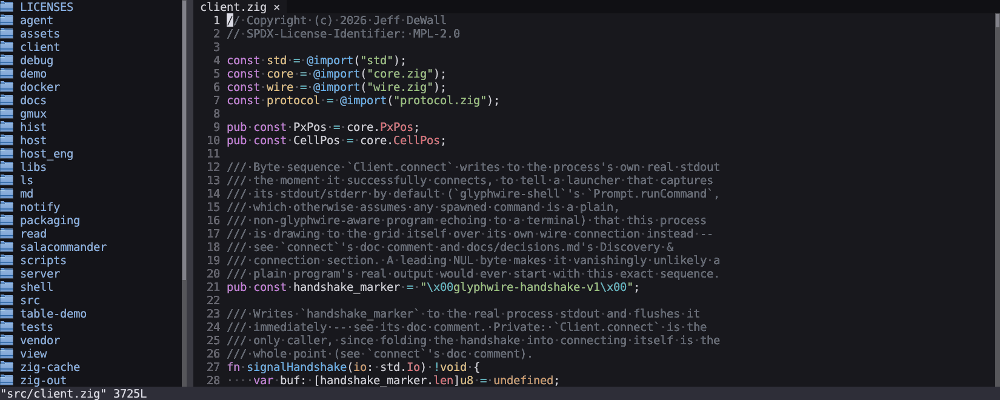
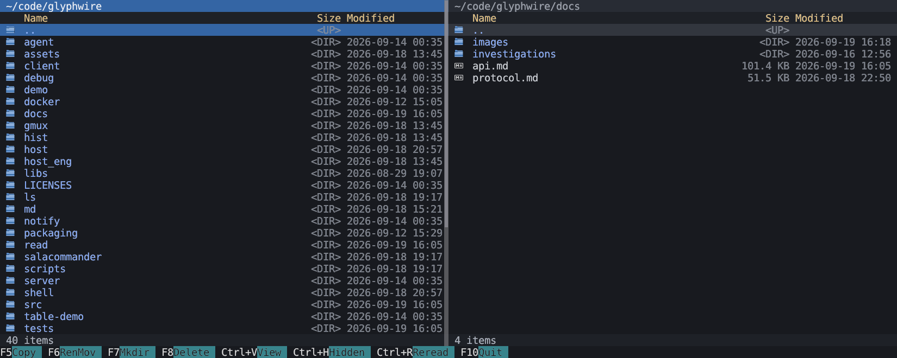
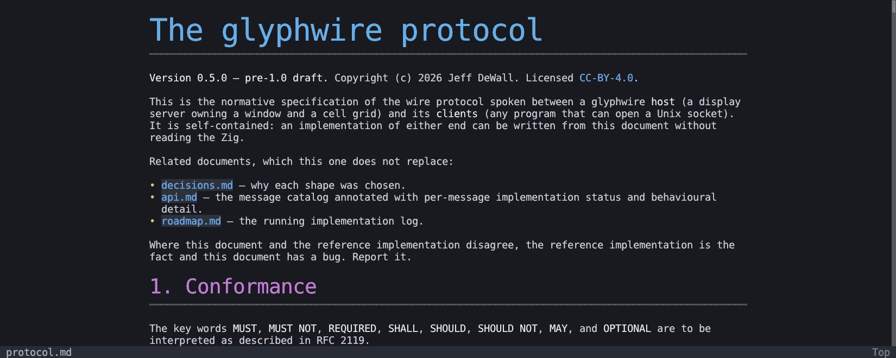
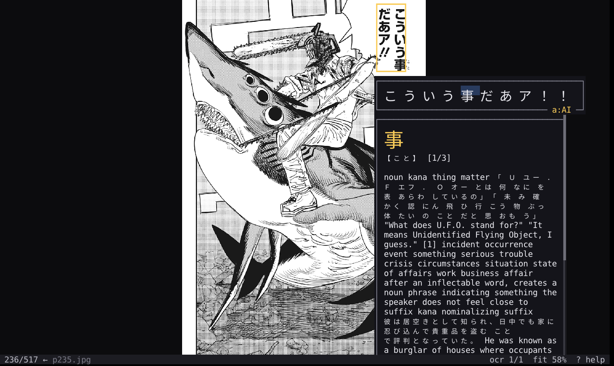

<!-- SPDX-License-Identifier: CC-BY-4.0 -->
# glyphwire


[](#license)

A 2D-grid terminal replacement. Programs talk to the display over a local
socket with structured JSON-RPC messages instead of a stream of ANSI
escape sequences.

- **No client library needed.** Anything that can open a Unix socket can
  speak the protocol. The Zig `Client` in `src/client.zig` is a convenience.
- **Graceful fallback.** A program finds the session through
  `GLYPHWIRE_SOCK`; without it, it writes plain stdout.
- **Still a terminal.** Plain programs run on a PTY and their escape
  sequences are interpreted, so ordinary terminal programs keep working.
- **State lives server-side.** Layers, tables, panes and contexts outlive
  the process that made them and are redrawn by the host without a round
  trip.
- **Atomic frames.** A `batch` applies many messages under one lock, so a
  listing appears whole instead of painting a band at a time.

[`docs/protocol.md`](docs/protocol.md) is the specification, enough to write
a client or a host in any language. [`docs/api.md`](docs/api.md) is the
annotated message catalog with per-message status.

## Screenshots

`gw-ls` as an icon grid:


`gw-ls -l -S` as a long listing in a server-side table:


`glyphwire-demo`: truecolor runs, swatches, a box/icon panel, and
multi-script text:


## Server-side features

| Feature | Key messages | What it gives you |
|---|---|---|
| **Contexts** | `create_context`, `activate_context`, `attach_context` | Independent full-window surfaces. A generalized alt-screen: the shell's scrollback sits untouched under a full-screen app and reappears when it exits. |
| **Panes** | `create_pane`, `spawn_in_pane`, `focus_pane`, `set_window_prefix` | Window-level split tree of panes, each running its own program on a host-managed PTY. What `gmux` is built on. |
| **Splits** | `create_split`, `set_split_children`, `move_divider` | Layout tree of layers inside a context, with weighted or fixed children and draggable dividers. Re-lays itself on window resize. |
| **Layers** | `create_layer`, `raise_layer`, `get_property` / `set_property` | Addressable surfaces with position, size, visibility, opacity and background. A viewport over a larger content grid scrolls host-side, with opt-in scrollbars. |
| **Text** | `write_text`, `insert_cells`, `delete_cells`, `move_content`, `clear`, `set_bg` | Truecolor styled runs or spans, text scale (1.5x, 2x, 3x) from re-rasterized font atlases, in-place cell editing, row shifting without a repaint, and background-only repaints for moving a highlight. |
| **Images** | `load_image`, `update_image`, `draw_image` | Real bitmaps (PNG, JPEG, BMP, GIF) placed in the grid, with source cropping. Bytes ride a binary side channel, never base64. |
| **Icons and boxes** | `draw_icon`, `draw_box` | A bundled icon catalog (file types, Devicon logos, distro logos) and 9-slice panels from tile sets. |
| **Rects** | `create_rect`, `update_rect`, `destroy_rect` | Pixel-space outlines and fills on a layer, independent of the cell grid. Good for marks, crop boxes and focus rings. |
| **Tables** | `create_table`, `table_set_rows`, `table_set_sort`, `table_set_style` | Typed, sortable tables with column widths, alignment and cell wrapping. Survive the client that created them. |
| **Metadata** | `create_metadata`, `tag_metadata`, `get_metadata`, `find_metadata` | Opaque client JSON attached to cells: a path to open, a link to follow. The server stores it and never parses it. |
| **Selection and clipboard** | `set_selection`, `get_selection_text`, `set_clipboard` | Host-drawn selection per layer, mirrored to the OS clipboard. |
| **Highlights** | `toggle_highlight`, `set_highlight` | Multi-select by metadata id, drawn by the host. |
| **Batching** | `batch` | Many messages applied in one pass as one rendered frame. |
| **Input** | `subscribe`, `set_key_repeat` | Opt-in key, text, mouse, resize and scroll events with modifier state. Per-program key repeat cadence. |
| **Remote sessions** | `start_remote`, `stop_remote` | Remote glyphwire clients drawing into a local pane over one ssh trunk (`gw-agent` on the far side). |

Planned: server-driven animation, action maps, capability negotiation,
wheel and gamepad streams.

## Applications

| App | What it is | What glyphwire makes possible |
|---|---|---|
| **`gw-shell`** | The shell `glyphwire` spawns | Pipelines, Lua config and scripting, history, completion, powerline prompts, `gwssh` remote sessions, and Ctrl+R history search through `gw-hist`. `--embed` runs the same prompt inside another client's layer. |
| **`zoe`** | Modal text editor | File tree, tabs and buffer in a host-side split tree. Incremental tree-sitter highlighting with embedded languages. Small scrolls move drawn rows instead of repainting. |
| **`gmux`** | Terminal multiplexer | A pure window manager: it draws nothing and never touches a program's I/O. It asks the server for panes and places them. |
| **`salacommander`** | Two-pane file manager | File-type icons, modal dialogs on their own layer, host scrollbars, only the visible rows sent. Ctrl+` drops a `gw-shell` into a panel that follows the active pane. Every key is a rebindable named action. |
| **`gwmd`** | Markdown reader | Scaled headings, GFM tables as native tables, inline images, clickable links. The document is one tall layer the host scrolls. |
| **`gw-read`** | Comic and manga reader | Pages as bitmaps with zoom and pan. Mokuro OCR text overlays, Yomitan dictionary lookup, AI bubble translation, Anki card mining. |
| **`gw-ls`** | `ls` replacement | Icon grid, or a long listing in a table that stays sortable after `gw-ls` exits. |
| **`gw-view`** | Image viewer | Shows an image in the grid, or `--interactive` for a context of its own with zoom and pan. |

Developer tools: `glyphwire-probe` drives and inspects a live session
from the command line (`zig build probe`), and `glyphwire-demo`,
`glyphwire-table-demo` and `glyphwire-notify` exercise parts of the
protocol.

### zoe

Editing its own client library, with the file tree and tab strip:



### salacommander

The repository on the left and `docs/` on the right:



### gwmd

Rendering [`docs/protocol.md`](docs/protocol.md), with scaled headings and
links:



### gw-read

A word highlighted in a speech bubble, with its dictionary entry up:



## Build and run

Requires Zig 0.17.0-dev.1857+3c46da14d. Dependencies are fetched or
vendored; SDL3 builds from source, so no system dev packages are needed.

| Command | Effect |
|---|---|
| `zig build` | Build every executable into `zig-out/bin/` |
| `zig build glyphwire` | Build and run the host (spawns `gw-shell`) |
| `zig build tests` | Run the test suite |
| `zig build package` | Shipped programs, grammars and assets into `zig-out/` |
| `zig build install-local --prefix /usr/local` | Install everything under a prefix |

Each program also has its own run step (`zig build zoe`, `zig build gwmd`,
...). CI builds a `glyphwire-linux-x86_64.tar.gz` on every push and attaches
it to the GitHub Release on a `vX.Y.Z` tag.

### Host options

| Option | Effect |
|---|---|
| `--ssh <dest>` | Open a remote session to `dest` |
| `--remote-command <cmd>` | The `gw-agent` command to run on the remote side |
| `--grid-cols <n>` / `--grid-rows <n>` | Starting grid size |
| `--screenshot <path>` | Write the grid to a PNG after a delay, then quit |
| `--screenshot-delay-ms <n>` | Delay before the capture (default 2500) |

Other arguments pass through to `gw-shell`. Setting `GLYPHWIRE_SHELL_SCRIPT`
to a file replays its lines at the prompt before interactive input starts.

## Configuration

Every config file is Lua, named `*.conf.lua`, and read from
`$GLYPHWIRE_CONFIG_DIR`, else `$XDG_CONFIG_HOME/glyphwire`, else
`~/.config/glyphwire`. All fields are optional.

| File | Configures | Reference |
|---|---|---|
| `host.conf.lua` | Font face, fallback and size, cursor, grid size, scrollback, icon theme | `host/host.conf.template.lua` |
| `shell.conf.lua` | Aliases, prompt segments, `zj` directory jumping, hooks | `shell/shell.conf.template.lua` |
| `gmux.conf.lua` | Prefix key, pane shell, scrollback | `gmux/gmux.conf.template.lua` |
| `zoe.conf.lua` | Languages, grammar path, colors, editor options | `zoe/zoe.conf.template.lua` |
| `ls.conf.lua` | Icon sizes | `ls/ls.conf.template.lua` |
| `read.conf.lua` | Reading direction, sizing, zoom, cache | `read/read.conf.template.lua` |
| `salacommander.conf.lua` | Key bindings | `salacommander/salacommander.conf.template.lua` |

`assets/*.conf.example.lua` are working setups to copy from. At runtime,
`Ctrl+-` / `Ctrl++` change the font size and `Ctrl+0` resets it.

## Repository layout

| Path | What |
|---|---|
| `src/` | Protocol core: grid model (`core.zig`), dispatch, server, client, wire framing, PTY, keybind |
| `host/`, `host_eng/` | `glyphwire`, the SDL3 / OpenGL host, and its engine backend |
| `shell/`, `hist/` | `gw-shell` and `gw-hist` |
| `zoe/`, `gmux/`, `salacommander/`, `md/`, `read/`, `ls/`, `view/` | Applications |
| `agent/` | `gw-agent`, the remote end of an ssh session |
| `debug/`, `demo/`, `table-demo/`, `notify/`, `client/`, `server/` | Developer tools and demos |
| `tests/` | testz suite |
| `docs/` | Protocol spec, API reference, design investigations |

## Regenerating the screenshots

```sh
scripts/regen-readme-assets.sh            # all scenes
scripts/regen-readme-assets.sh ls-grid    # just one
```

Scenes are defined at the top of the script. `docs/images/gw-read.png` is
taken by hand.

## License

Full detail in [`LICENSE.md`](LICENSE.md); third-party code and assets in
[`THIRD-PARTY.md`](THIRD-PARTY.md).

| Part | License | Meaning |
|---|---|---|
| **The protocol**: `docs/` | `CC-BY-4.0` | Implement it in any language, under any license. |
| **The plumbing**: `src/`, `host/`, `host_eng/`, `server/`, `client/`, `agent/`, demos and debug tools | `MPL-2.0` | File-level copyleft: owe source only for MPL files you change. |
| **The applications**: `gw-shell`, `gw-hist`, `gmux`, `gw-ls`, `gw-view`, `gw-read`, `gwmd`, `zoe`, `salacommander` | `GPL-3.0-or-later` | Programs people run, not components people embed. |

Every source file carries an `SPDX-License-Identifier`. The default icon
theme (Oxygen) is LGPL-3.0 and Papirus is GPL-3.0; set
`icon_theme = "material"` for the MIT Material theme if that matters.

## Contributing

See [`CONTRIBUTING.md`](CONTRIBUTING.md). Code contributions are accepted
under a [Contributor Licence Agreement](CLA.md); bug reports and design
feedback need none.

Copyright (c) 2026 Jeff DeWall.
