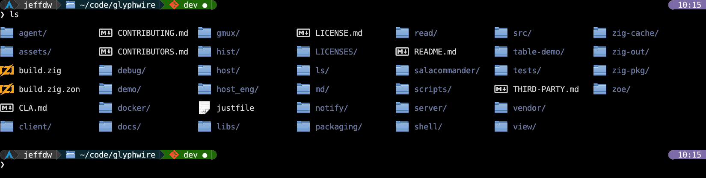
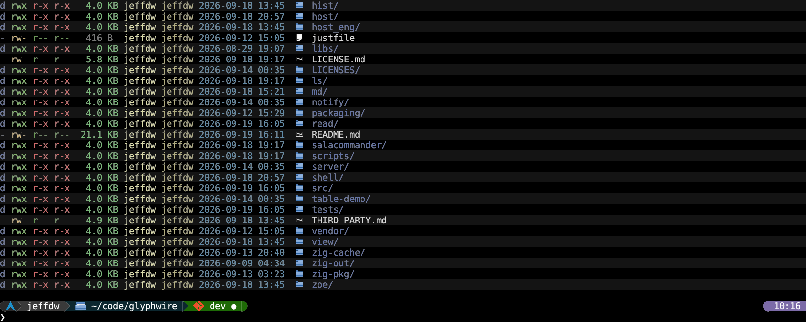
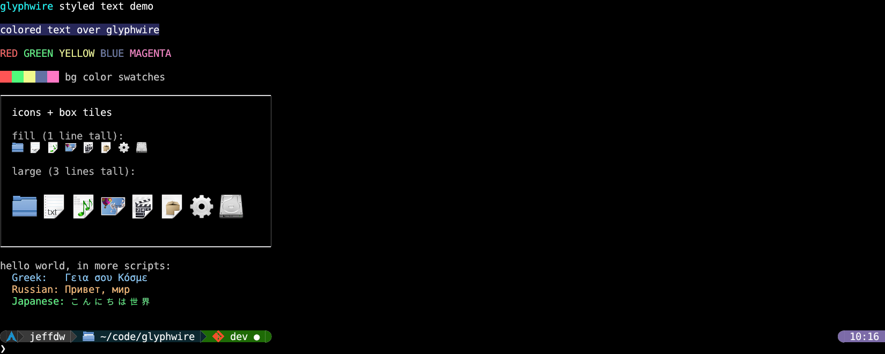
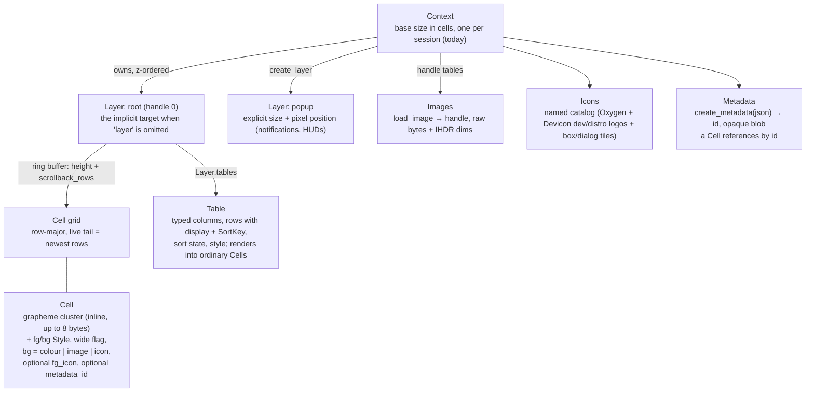
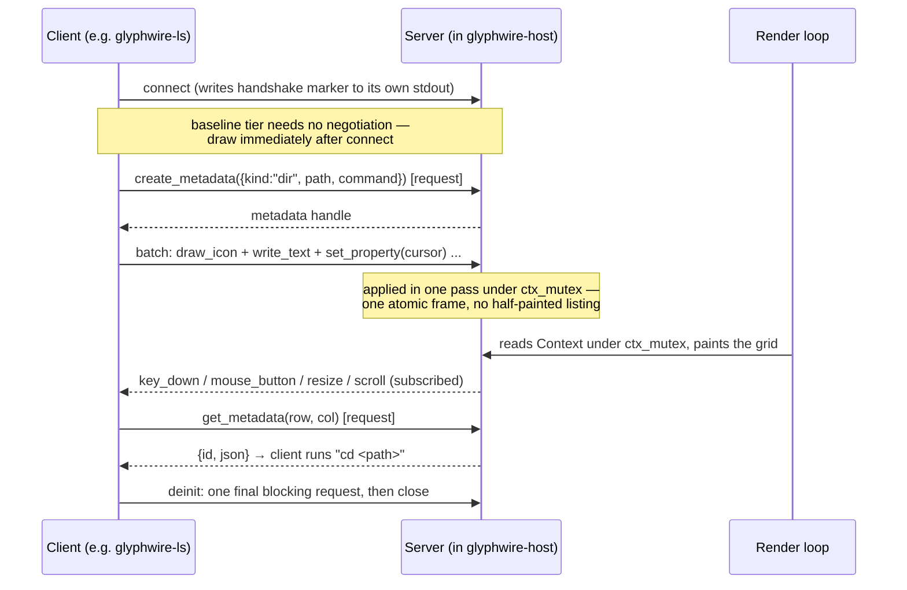

# glyphwire

A 2D-grid terminal replacement. Instead of a stream of VT100/ANSI escape
sequences, programs talk to a display server over a local socket using
structured JSON-RPC messages: text with real truecolor styling, images,
icons, box/panel tiles, server-side table widgets, a layer system with
scrollback and animated scroll, and input (keyboard, mouse, gamepad,
resize) delivered as raw events or engine-style mapped actions.

Sub-programs need **no client library** — anything that can open a Unix
socket and read/write bytes can speak the protocol (the Zig `Client` in
`src/client.zig` is a convenience, not a requirement). Discovery mirrors
systemd's `NOTIFY_SOCKET` pattern: a glyphwire-aware shell sets
`GLYPHWIRE_SOCK` / `GLYPHWIRE_CTX` before `exec`, and a program that finds
them connects; a program that doesn't degrades to plain stdout.

The renderer (`glyphwire-host`) is built on `pixzig` (a sibling repo at `../pixzig`), an
existing Zig 2D game engine (GLFW / OpenGL).

> Status: pre-1.0, single context, single root layer plus `create_layer`
> popups. `docs/decisions.md` is the "why", `docs/api.md` the concrete
> wire reference, `docs/roadmap.md` the running implementation log.

## Screenshots

Directory listing as an icon grid (`glyphwire-ls`, drawn over the wire onto
the host grid):



Long listing rendered through the server-side table widget — columns,
alternating-row background stripes, per-entry icons, magnitude-coloured
sizes (`glyphwire-ls -l -S`):



Styled-text demo — truecolor fg/bg runs, colour swatches, a box/icon
panel, and multi-script text through the on-demand font atlas
(`glyphwire-demo`):



These are regenerated by [`scripts/regen-readme-assets.sh`](scripts/regen-readme-assets.sh)
— see [Regenerating the screenshots](#regenerating-the-screenshots).

## Architecture

### Processes and transport

`glyphwire-host` owns the `Context` and `Server` **in-process** — it reads
and writes the grid directly with no wire round trip for its own state —
and runs `Server.serveForever` on a background thread so socket clients
work normally. It spawns `glyphwire-shell` (a pure wire client, no pixzig
dependency) as a separate process, which in turn launches commands with
the discovery env vars set.

```mermaid
flowchart TB
    subgraph host["glyphwire-host process (pixzig window)"]
        Ctx["Context + Layers + Tables<br/>(in-process)"]
        Srv["Server<br/>(serveForever on a thread)"]
        Render["render loop<br/>(draws the grid, reports input)"]
        Render --- Ctx
        Srv --- Ctx
    end

    Sock(["Unix socket<br/>$GLYPHWIRE_SOCK"])
    Srv <--> Sock

    Shell["glyphwire-shell<br/>(line editor, launches commands)"]
    Clients["glyphwire-ls / -view / -notify / -demo<br/>-table-demo, or any socket program"]

    Sock <-->|"JSON-RPC 2.0 + Content-Length framing"| Shell
    Sock <-->|"draw commands ↑ / input notifications ↓"| Clients

    host -->|"spawn, sets GLYPHWIRE_SOCK / GLYPHWIRE_CTX"| Shell
    Shell -->|"spawn (env inherited)"| Clients
```



### Object model

Every message is an operation on this small set of objects.



### A client session



## What the protocol gives you, and why it matters

| Capability | Messages | Why it's useful |
|---|---|---|
| **Styled text** | `write_text` (`fg`, `bg`, `transparent_bg`, `metadata_id`) | Truecolor per run with no escape-sequence quoting or state leakage. C0 control bytes and a Phase-A subset of SGR/CSI escapes are still interpreted, so plain programs piped through a PTY render correctly, but a glyphwire-aware program never has to emit them. |
| **Cell editing** | `insert_cells`, `delete_cells`, `clear` | ECMA-48 ICH/DCH so a line editor edits in place instead of retransmitting a whole line; `clear` resets a region (or the screen) to blank without painting spaces over content. |
| **Layers** | `create_layer`, `destroy_layer`, `get_property` / `set_property` (`cursor`, `position`, `size`, `revision`, `scroll`) | A popup, notification, or HUD is its own addressable surface with a pixel-precise position you can animate — it composites over the shell's scrollback without disturbing it. Every draw message takes an optional `layer`; omit it and you get the root. |
| **Scrollback & resize** | `scroll_view`, `resize` / `scroll` notifications, `get_cells` with `view_offset` | The ring-buffer scrollback is readable over the wire, so a client can inspect exactly what's on screen while the host is scrolled back (how a click in scrollback resolves to the right cell). Window resize is bottom-anchored and non-destructive. |
| **Images** | `load_image` (binary side-channel), `get_image_info`, `draw_image`, `get_cell_metrics` | Show real bitmaps in the grid — an image viewer, TUI background art — placed at natural size and clipped, not stretched. Binary bytes ride a length-prefixed side channel, never base64 in JSON. |
| **Icons** | `draw_icon` (`scale` fit / natural / stretch, `h_align` / `v_align`, `max_w` / `max_h`, `foreground`) | A bundled named catalog (KDE Oxygen file-type art, Devicon language/tool + distro logos) so every tool doesn't reload its own "folder" / "audio file" art. `foreground: true` composites over a background instead of replacing it. |
| **Boxes / panels** | `draw_box` (`style`, `mode` tile / stretch) | 9-slice panels and borders from tile sets; `stretch` mode treats an edge/fill role as one continuous picture so a gradient panel blends smoothly at any size. |
| **Tables** | `create_table`, `table_set_rows`, `table_set_sort`, `table_set_style`, `table_get_state`, `destroy_table` | Structured, typed, sortable table state that lives **server-side** and survives the process that created it — `glyphwire-ls -l` can exit and the table is still there to re-sort or restyle. Sorts on a typed `SortKey`, not the display string. |
| **Metadata** | `create_metadata`, `destroy_metadata`, `get_metadata`, `tag_metadata` | Tag a cell (or a whole `write_text` run) with opaque client-defined JSON — a command to run on select, a file path for a context menu. The server stores the blob and never parses it. |
| **Batching** | `batch` (notification or request form) | Apply an ordered list of messages in one server pass under a single lock — a whole `ls` listing goes from prior state to finished in one rendered frame instead of painting a band at a time. |
| **Input** | `subscribe`, `report_key` / `report_mouse_button` / `report_mouse_move`, `key_down` / `key_up` / `mouse_button`, `get_input_state` | Opt-in per event type (X11 event-mask style). Raw key/mouse/resize/scroll events are delivered now; `InputListener` is the live-updating client-side consumer. |
| **Planned** | `create_context`, `animate` / `animation_complete`, `mouse_move` / `mouse_scroll` streams, `action` maps, `initialize` / `initialized` capability negotiation | Server-driven tweens (no per-client 60 Hz loop over IPC), multiple persistent contexts (generalized alt-screen), and LSP-style capability exchange. Shapes are decided in `docs/decisions.md`; not yet wired. |

See `docs/api.md` for the full message catalog with parameter lists and
per-message status markers (✅ implemented / 🔶 planned / ⬜ open).

## Build and run

Requires a recent Zig (0.17.0-dev — see `build.zig.zon`) and, for the
host, a working GLFW/OpenGL setup. `pixzig` is a path dependency at
`../pixzig` (a sibling checkout).

```sh
zig build                 # build every executable into zig-out/bin/
zig build tests           # run the unit + e2e test suite
zig build host            # build + run glyphwire-host (spawns glyphwire-shell)
```

Individual run steps: `zig build shell`, `zig build ls`, `zig build demo`,
`zig build table_demo`, `zig build view`, `zig build notify`,
`zig build server`, `zig build client`.

Once `glyphwire-host` is running, its shell prompt launches the client
programs (`ls`, `glyphwire-demo`, `glyphwire-view `,
`glyphwire-notify <msg>`) with discovery already set up, so they draw onto
the grid.

### Host options (screenshots / smoke runs)

`glyphwire-host` forwards unknown arguments to `glyphwire-shell`, but
consumes a few of its own:

| Option | Effect |
|---|---|
| `--screenshot <path>` | After `--screenshot-delay-ms`, write the composited grid region (margins and scrollbar excluded, height cropped to the rows actually used) to `<path>` as a PNG, then quit. Reads its own GL framebuffer — no external screenshot tool. |
| `--screenshot-delay-ms <n>` | Milliseconds to wait before capturing (default 2500). |
| `--grid-cols <n>` / `--grid-rows <n>` | Open at a non-default grid size. |

The spawned shell also honours **`GLYPHWIRE_SHELL_SCRIPT`**: if it names a
readable file, each non-blank, non-`#` line is replayed through the prompt
as if typed and entered, before the interactive key loop starts. Combined
with `--screenshot` this drives a fully automated capture with no
keystroke injection.

### Font configuration

`glyphwire-host` runs **`~/.config/glyphwire/host.conf`** at startup, if
present, for a global `config` table. The directory is resolved the same
way as the shell's `shell.conf`: `$GLYPHWIRE_CONFIG_DIR` verbatim when
set, else `$XDG_CONFIG_HOME/glyphwire`, else `$HOME/.config/glyphwire`.
See `host/host.conf.template` for the full annotated reference.

| Field | Default | Notes |
|---|---|---|
| `font_face` | `assets/NotoSansCJK-Regular.ttc` | TTF/OTF, or a TTC collection. Relative paths resolve against the host's working directory (the repo root in dev mode), not `host.conf`'s directory. |
| `font_face_name` | `Mono CJK JP` | Substring of the face name to pick out of a TTC; ignored for a plain font. |
| `font_fallback` | `assets/JetBrainsMono-Regular.ttf` | Face used for codepoints the primary lacks. |
| `font_size` | `20.0` | Starting cell size in px, clamped to 8..72. |

(`host.conf` also carries `cursor_shape` / `cursor_blink` /
`cursor_blink_ms` and `grid_cols` / `grid_rows` / `scrollback_rows`; see
the template.) Every field is optional and any omitted one keeps its
default; a missing file (or no config directory at all) uses all
defaults. At runtime **`Ctrl+-`** / **`Ctrl++`** step the
font size by 2px and **`Ctrl+0`** restores the configured size — the
window resizes to keep the same column/row count (best effort; a tiling
WM that pins the window reflows the grid instead).

## Regenerating the screenshots

```sh
scripts/regen-readme-assets.sh            # all scenes
scripts/regen-readme-assets.sh ls-grid    # just one
```

For each scene the script writes a one-line command file, then launches
`glyphwire-host` with `GLYPHWIRE_SHELL_SCRIPT` pointing at it and
`--screenshot docs/images/<scene>.png`. A Wayland or X session must be
available for the window to open. Env overrides: `GLYPHWIRE_SHOT_DELAY_MS`,
`GLYPHWIRE_SHOT_TIMEOUT`.

Scenes are defined in the `scenes` map near the top of the script — add a
name and its shell command there to capture a new one.

## Repository layout

| Path | What |
|---|---|
| `src/core.zig` | Headless grid model — `Context`, `Layer`, `Cell`, `Table`, width tables, SGR/CSI interpreter. No IO. |
| `src/dispatch.zig` | Wire message → `core` operation routing. |
| `src/server.zig` | Unix socket server, one thread per connection, notification fan-out. |
| `src/client.zig` | `Client` + `InputListener` convenience library. |
| `src/protocol.zig` / `src/rpc.zig` | Shared wire DTOs and envelope helpers (both ends `@import` these). |
| `src/wire.zig` | `Content-Length` framing, binary side-channel reads. |
| `host/` | `glyphwire-host` — the pixzig-windowed renderer. |
| `shell/` | `glyphwire-shell` — line editor, command launcher, PTY, Lua startup config, history. |
| `ls/`, `view/`, `notify/`, `demo/`, `table-demo/`, `client/` | Client programs. |
| `server/` | Standalone socket server (host embeds its own; this is for testing). |
| `tests/` | testz suite — `core`, `wire`, `dispatch`, `table`, `server`, `client`, `shell`, `ls`, `e2e`, ... |
| `docs/` | `decisions.md`, `api.md`, `roadmap.md`, `investigations/`. |
