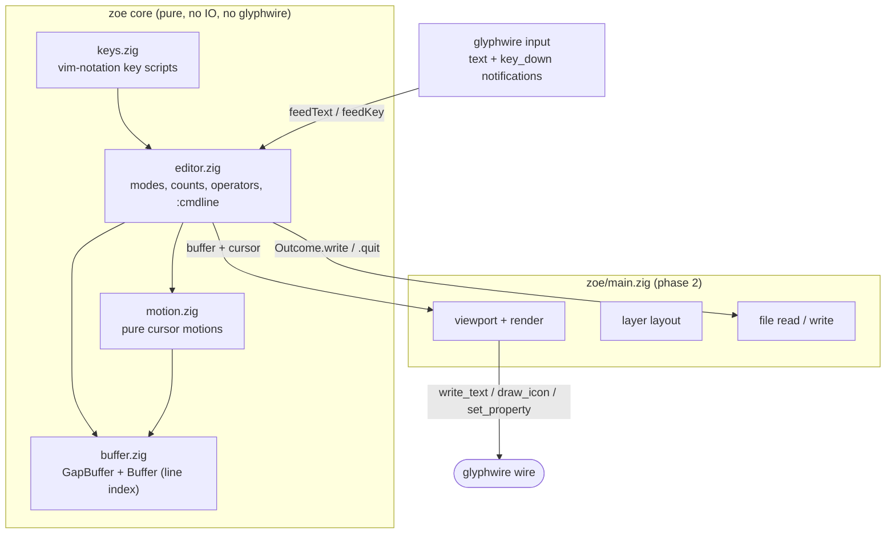

# zoe — a modal editor on the glyphwire object model

The plan for glyphwire's first real TUI, and the running record of what
is built.

zoe is a vim-like modal editor. The point is not to re-implement vim; it
is to be the first program that leans on glyphwire's object model instead
of pretending to be a terminal — multiple layers, real per-cell styling,
icons in the file tree, metadata on cells so a click resolves to a
thing — and in doing so to find out which parts of the protocol are
actually load-bearing for a full-screen program. Every protocol gap
listed in "Protocol work" below was found by sketching this, not by
reading the API doc.

It lives in-tree at `zoe/`, alongside `ls/` and `view/`, so a protocol
change and the client change that needs it land in one commit. The
boundary is kept explicit so extracting it later is mechanical: **zoe
imports `src/client.zig` and `src/protocol.zig` only**, never `core.zig`
or `dispatch.zig` internals.

## Status

| Phase | What | State |
|---|---|---|
| 0 | Protocol: settable layer `size`, `visibility`, `raise_layer` / `lower_layer`, `cell_position` | ✅ built |
| 1 | Editor core: gap buffer, line index, motions, normal/insert/command modes | ✅ built |
| 2 | The glyphwire client: layers, viewport, rendering, statusline, real `:w`/`:q` | ⬜ next |
| 3 | Undo/redo and registers (`u`, `Ctrl-R`, `y`/`p`) | ⬜ |
| 4 | File tree in its own layer | ⬜ |
| 5 | Lua extension layer (shared `src/script.zig`, extracted from `shell/script_engine.zig`) | ⬜ |
| 6 | Syntax highlighting (tree-sitter is already a dependency, via testz) | ⬜ |

## Architecture



### Why a gap buffer

The edit pattern of a modal editor is "many small edits clustered at one
point, then a jump". A gap buffer makes insertion and deletion at the gap
O(1) and pays only on a cursor jump, which is exactly the right trade —
and it is one contiguous allocation, so `get_cells`-style bulk reads for
rendering are two `@memcpy`s at worst. A rope would win on very large
files and on structural sharing for undo; that is a swap behind
`buffer.zig`'s interface if it ever matters, not a decision to make now.

The one deliberate shortcut is the line index: `Buffer.reindex` rescans
the whole text after every edit rather than fixing up offsets from the
edited line onward. It is O(text) per keystroke, obviously correct, and a
few hundred microseconds on the files zoe opens. The incremental version
is contained entirely within that one function.

Offsets are **bytes** throughout; the buffer is byte-transparent, so a
file zoe can't decode still round-trips through a save uncorrupted.
`motion.zig` is what respects codepoint boundaries, so the cursor never
lands mid-sequence. Grapheme clusters and East Asian display width are
deferred to the renderer, where glyphwire's `stringWidth` already lives.

### Why input comes in as two streams

glyphwire delivers committed text (`text`) separately from named physical
keys (`key_down`) — decisions.md's Input model. zoe uses both, and the
split turns out to be exactly what a modal editor wants rather than an
inconvenience:

- **Normal-mode commands are characters**, so they are dispatched off
  `feedText`. `j` means "down" on Dvorak and AZERTY because the keycode
  the layout produces is what arrives.
- **Escape and the arrows have no character**, so they arrive through
  `feedKey` by name (`"escape"`, `"left"`, ...).
- **IME commit text is just text.** Typing Japanese in insert mode works
  with no special case, because the host already resolves composition
  before anything reaches the wire.

One consequence worth stating: a chunk of committed text can change the
mode partway through (`ihello` is one command and five characters), so
`feedText` re-checks the mode per codepoint and hands the remainder to
the insert path once `i` has run.

### Why the core does no IO

`:w` does not write a file. It returns `Outcome.write` and the host does
the writing, then calls `markSaved`. That keeps the entire state machine
testable with nothing but an allocator — every editor test in
`tests/zoe_tests.zig` runs with no filesystem and no window — and it
means the eventual Lua `zoe.write()` goes through the same outcome the
keystroke does rather than growing a second path to disk.

## What phase 1 implements

Modes: `normal`, `insert`, `command` (the `:` line). Operator-pending is
a field, not a mode, because nothing outside the state machine needs to
see it.

| | Keys |
|---|---|
| Motions | `h` `j` `k` `l`, `w` `W` `b` `B` `e` `E`, `0` `^` `$`, `gg` `G`, arrows / Home / End, PageUp / PageDown / Ctrl-D / Ctrl-U (by `page_lines`, default 10, `zoe.conf`-settable) |
| Counts | `3j`, `10l`, `3G`, `2gg`, and `2d3w` (the counts multiply, as in vim) |
| Insert | `i` `a` `I` `A` `o` `O`, Escape, Backspace, Enter, Delete |
| Edits | `x` `X` `D` `C` `s`, `dd`, `d{w,b,e,h,l,0,^,$}`, `dj` `dk` `dG` `dgg` |
| Command line | `:w [file]`, `:q`, `:q!`, `:wq` / `:x`, `:e[!] [file]`, `:cd [dir]` / `:pwd`, `:<number>`, `:$` / `:.` / `:+N` / `:-N`, and `:{count}{motion}` (`:23k`) |

Two vim behaviours worth calling out because they are the ones people
notice when they're missing, and both are covered by tests: the sticky
column (walking `j` through a short line and out the other side returns
to the original column), and `dw` stopping at the end of a line rather
than pulling the next line up onto it.

**Not implemented, in rough priority order:** undo/redo, registers and
`y`/`p`, visual mode, search (`/`, `n`), `.` repeat, `r`/`~`, `J`, marks,
`c{motion}` (only `C` and `s` exist), `<`/`>`, and multiple buffers or
windows.

### The key-script harness

`zoe/keys.zig` parses vim notation — `"ihello<esc>3jdd"` — and feeds it
through the real `feedText`/`feedKey` pair. It is what the tests are
written in and what `zoe --keys` runs, so the tests exercise the actual
input path rather than reaching past it into the edit functions. `<esc>`,
`<cr>`, `<bs>`, `<del>` map onto glyphwire's key names; `<lt>` and
`<space>` are characters; anything else passes through as a key name, so
a key glyphwire grows later needs no change here.

Until phase 2, `zoe/main.zig` is a driver for this rather than an editor
you can sit in:

```sh
zig build zoe -- --keys 'ihello<esc>' notes.txt
zig build zoe -- --keys ':%s is not implemented<cr>'   # reports E492
```

## Protocol work

Four gaps, all found by sketching the phase-2 layout (a file tree layer
beside a buffer layer, with a statusline). All four are built; the
reasoning is in decisions.md's Layer section and the wire shapes are in
api.md.

| Gap | Shape | Why a TUI needs it |
|---|---|---|
| A layer's size was fixed at creation | `set_property(layer, "size", {cols, rows})` | Two panes have to reflow on a `resize`. The alternative was destroy-and-recreate, which loses the layer's handle, tables, metadata ids and content |
| No way to hide a layer | `set_property(layer, "visibility", {visible})` | Toggling the file tree. Destroying it loses its scroll position and its per-entry metadata for nothing |
| Compositing order was creation order | `raise_layer` / `lower_layer` | A completion popup created at startup must sit over a tree created later |
| Position was pixels only | `set_property(layer, "cell_position", {row, col})` | A TUI lays out in cells; doing the conversion client-side breaks on a font-size change, which nothing announces |

Deliberately **not** added: input focus routing. Input is broadcast to
subscribers, and zoe is one process that already knows which of its own
panes has focus. A focus concept only earns its place once two separate
processes draw into one context.

## What phase 2 needs to decide

Written down now so the phase-1 shapes above aren't quietly assuming
answers:

- **Layer layout.** Almost certainly three: tree (left, hideable), buffer
  (right), statusline (bottom, one row). All three sized in cells from
  the root's `size` and re-laid-out on `resize` — which is what the
  settable `size` and `cell_position` exist for.
- **Alt-screen behaviour.** zoe draws on layers above the shell's root,
  so the shell's scrollback is untouched underneath and reappears when
  zoe exits, with no `create_context` needed. Whether that stays true
  once zoe wants the whole window is the thing to check first.
- **Viewport scrolling.** The buffer layer's `scrollback_rows` should be
  0: zoe owns its own scroll position (which buffer line is at the top of
  the pane) and redraws, rather than pushing rows into a ring buffer it
  would then have to fight with.
- **Redraw granularity.** The naive version redrew the visible pane every
  keystroke inside one `batch` (one atomic frame, per the batching
  decision), which is `rows` `write_text` pairs down the socket per tick
  and felt heavy. Landed in three passes: (1) `planBufferRender` shifts
  the rows the layer already holds with one `move_content` on a pure
  sub-screen scroll and repaints only the exposed band; (2) `render`
  gates each pane on its own dirty flag (`buffer_dirty` / `tree_dirty` /
  `status_dirty`), so a `:` line keystroke redraws just the status row --
  no per-row syntax pass over the buffer, no `draw_icon` per tree entry
  (the reported command-line lag); (3) a pure cursor move (bare `hjkl`, a
  word motion, an on-screen `:23k`) with no edit and no scroll repaints
  only the two rows the caret left and landed on (`repaintCaretRows`). A
  true per-line diff on an *edit* is still the remaining step and wants
  the per-line dirty tracking below.
- **`Buffer.dirty` vs. per-line dirty.** The core tracks one modified
  flag plus a monotonic `Buffer.edits` counter today (the counter is what
  `planBufferRender` diffs to tell an edit from a pure scroll). A renderer
  that wants to redraw only the changed lines on an edit will want a
  per-line version, and that belongs in `buffer.zig` rather than being
  reconstructed by the renderer.

## Lua

The extension language is Lua, the same as the shell's, and the intent is
one shared engine rather than two. `shell/script_engine.zig` already
carries the parts that are not shell-specific: the instruction-count
interrupt hook, the wall-clock deadline that stops a runaway script, the
registry-backed command table that keeps a user-defined `string` from
clobbering the stdlib, and the `<scripts_dir>/<name>.lua` loading
convention. Those move to `src/script.zig`, and the shell and zoe each
embed it with their own host-hook struct and their own API table
(`sh.*` for one, `zoe.*` for the other).

That extraction is phase 5 and deliberately after phase 2: the useful
surface to expose is the one the renderer and the command dispatcher
turn out to need, and guessing at it before they exist is how you get an
API nobody uses. The one shape already fixed is that a Lua command
returns the same `Outcome` a keystroke does — there is one path to disk,
not two.
